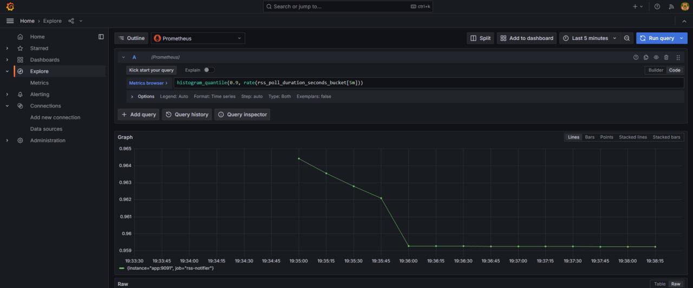
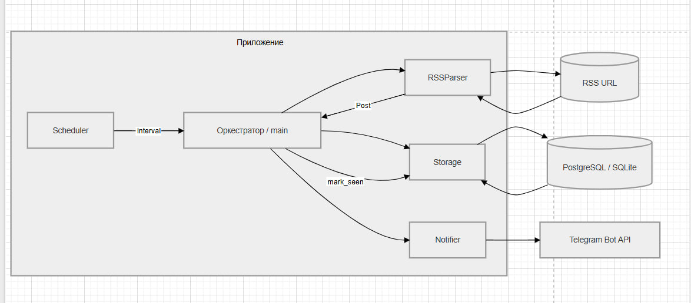

# RSS → Telegram notifier

Периодический опрос RSS-ленты и уведомления в Telegram. Реализованы **RSSParser**, **Storage** (PostgreSQL в Docker или SQLite локально), **Notifier**, APScheduler, метрики Prometheus, опционально Grafana.

## Запуск в Docker

Нужны **Docker Engine** и **Docker Compose**.

1. Клонируйте репозиторий и перейдите в каталог проекта.
2. Скопируйте шаблон окружения и заполните значения:
   ```bash
   cp .env.example .env
   ```
   Обязательно укажите в `.env`: **`TELEGRAM_BOT_TOKEN`** (или **`API_KEY`**), **`TELEGRAM_CHAT_ID`**, **`RSS_FEED_URL`**. Остальное при необходимости см. таблицу ниже.
3. Соберите образы и поднимите **PostgreSQL** и приложение:
   ```bash
   docker compose up --build # без метрик
   ```
   Compose сам задаёт **`DATABASE_URL`** на контейнер `postgres`, ждёт **`healthcheck`** БД, монтирует volume **`pgdata`** для данных. У сервиса **`app`** открыт порт **9091** — сырые метрики: `http://localhost:9091/metrics`.

Остановка: `Ctrl+C` или в другом терминале `docker compose down`. Чтобы удалить и том с БД: `docker compose down -v`.

### Prometheus и Grafana

**Prometheus** забирает метрики по HTTP (pull), **Grafana** подключается к Prometheus и строит графики. Счётчики и гистограмма описаны в `app/metrics.py`.

Поднять вместе с приложением **Prometheus** и **Grafana**:

```bash
docker compose --profile monitoring up --build
```

- **Prometheus**: [http://localhost:9090](http://localhost:9090) (Graph, PromQL).
- **Grafana**: [http://localhost:3000](http://localhost:3000), логин / пароль по умолчанию **`admin`** / **`admin`** (в проде смените). Datasource Prometheus подхватывается из `deploy/grafana/provisioning/`.

#### Скриншоты Grafana

**Первый скрин:** запрос `rate(rss_items_parsed_total[5m]) * 60` — примерная скорость разбора элементов RSS в минуту.

![Grafana: rate(rss_items_parsed_total[5m]) * 60](static/gafana.jpg)

**Второй скрин:** запрос `histogram_quantile(0.9, rate(rss_poll_duration_seconds_bucket[5m]))` — оценка 90-го перцентиля длительности цикла опроса (сек).



### Тесты (локально)

```bash
python -m venv .venv
source .venv/Scripts/activate   # Windows: .venv\Scripts\activate
pip install -r requirements.txt -r requirements-dev.txt
pytest
```

На GitHub при пуше/PR в `main` или `master` запускается [CI](.github/workflows/ci.yml): pytest (Python 3.9 и 3.11) и сборка Docker-образа.

Переменные окружения (см. `.env.example`):

| Переменная | Назначение |
|------------|------------|
| `TELEGRAM_BOT_TOKEN` или `API_KEY` | Токен бота от @BotFather |
| `TELEGRAM_CHAT_ID` | Куда слать . Без него сообщения не уходят и посты **не** помечаются в БД (чтобы не потерять уведомления) |
| `RSS_FEED_URL` | URL RSS или Atom |
| `DATABASE_URL` | Если задан — **PostgreSQL** (`psycopg`). В Docker Compose задаётся автоматически |
| `DATABASE_PATH` | Путь к файлу SQLite, если `DATABASE_URL` пуст (локальная разработка без Postgres) |
| `POLL_INTERVAL_SECONDS` | Период опроса (не меньше 30) |
| `METRICS_PORT` | Если задан — экспорт `/metrics` для Prometheus (в Compose для `app` уже **9091**) |

## 1. Схема взаимодействия компонентов

Текстом: **планировщик** по таймеру вызывает **оркестратор** (цикл в `main`). Оркестратор просит **RSSParser** скачать и разобрать ленту в список `Post`. **Storage** отфильтровывает уже виденные записи (по данным в **БД**). **Notifier** отправляет сообщения в Telegram Bot API. После успешной отправки **Storage** фиксирует факт обработки, чтобы при следующем запуске или рестарте дубликаты не ушли повторно.



## 2. Модели данных

Доменная сущность описана в Pydantic: `app/models/post.py` — поля **title**, **link**, **published_at**, **content_hash**, опционально **external_id** (`guid` из RSS).

## 3. Логика дедупликации

1. **Стабильный ключ записи**: приоритет `guid` из элемента RSS (если есть и не пустой); иначе нормализованный **link** как первичный идентификатор материала.
2. **Хэш содержимого**: `content_hash` = SHA-256 от нормализованной строки (заголовок + ссылка + summary/body), см. `app/utils/hashing.py`. Это отличает «тот же URL, но текст поправили» от полного совпадения.
3. **Правило «новый пост»**: в БД нет строки с таким ключом **или** для этого ключа сохранённый `content_hash` отличается от текущего (редкий случай обновления материала).
4. **Идемпотентность при рестарте**: состояние хранится **в БД** (файл SQLite или PostgreSQL с томом в Docker), а не только в памяти процесса. После успешной отправки выполняется `mark_seen` (UPSERT). Если процесс упал **до** `mark_seen`, при повторе возможен повторный пуш одного поста — в проде обычно добавляют **outbox** с подтверждением от API или транзакцию «отправил → записал».

## 4. Почему такой подход к «кешированию»

- **Персистентное хранилище (SQLite или PostgreSQL)** вместо чистого in-memory: после перезапуска контейнера или сервера набор «уже отправленных» не теряется, что и требуется от антидубликата.
- **Не кешируем всю ленту**: храним минимальный набор (ключ + хэш + опционально время), чтобы не раздувать БД и не дублировать контент сайта.
- **content_hash** рядом с ключом: защита от ложного «уже видели», если издатель изменил заголовок/описание при том же URL.
- При необходимости поверх БД можно добавить **краткоживущий in-memory LRU** по ключам в рамках одного процесса, чтобы снизить число чтений при плотном polling.

## Структура репозитория

```
app/
  __init__.py
  main.py           # цикл опроса + APScheduler
  config.py         # настройки из .env
  rss_parser.py     # class RSSParser
  storage.py        # class Storage
  notifier.py       # class Notifier
  models/post.py    # Pydantic Post
  utils/hashing.py  # SHA-256 для дедупликации
```

Парсер RSS, хранилище и отправка в Telegram реализованы; конфигурация — через переменные окружения и Docker Compose.

